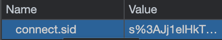

# Session
쿠키로 로그인 아이디, 비밀번호 등을 저장한다면 내용이 유출되어 보안 문제가 발생할수 있어 실무에서는 잘 사용하지 않는다.

이는 세션을 통해 보안을 강화할수 있다. 아래 그림은 실제 쿠키에 저장된 값이다.


- 세션 값으로는 어떤 정보도 알수없으며, 단지 사용자를 식별하는 값으로서 기능한다.
- 즉, `세션은 사용자의 민감한 정보는 서버쪽에 은밀하게 저장되어 보호`하고, 사용자의 웹 브라우저에는 `이 정보가 사용자의 것인지 아닌지를 식별`하는 데이터만 저장한다.
- 그래서 현대적인 애플리케이션은 인증을 쿠키로 하지 않는다. 쿠키는 사용자를 식별하는데만 사용하고, 실세 데이터는 서버쪽에 안전하게 파일이나 데이터베이스로 저장된다.

## 인증에서 cookie를 써야할까? session을 써야할까?
oauth2는 사용자 정보를 가져오기 위해, authorization_token을 발급받아야 한다.

### authorization_token 저장을 cookie, session으로 각각 한다면?
- cookie를 쓴다면, jwt와 같은 sign된 토큰값으로 변환후 저장한다. 인증할때, jwt 검증하여 authorization token을 추출한다.
```
jwt.token = jwt('asdqweadasdasd') // jwt token으로 변환
cookie.authorization = jwt.token // cookie에 저장
```

- session은 그대로 저장해서 사용하면된다. 인증할때, session에 저장된 authorization token을 추출한다.
```
session.authorization = 'asdqweadasdasd' // 그대로 session에 저장
```

## express-session 사용
`npm install express-session`

## 세션 사용

아래와 같이 세션을 설정해준다.
```js
app.use(session({
    secret: 'keyboard cat',
    resave: false,
    saveUninitialized: true
}));

app.use(function(req, res, next) {
    if (!req.session.views) {
        req.session.views = {};
    }

    var pathname = parseurl(req).pathname ;
    req.session.views[pathname] = (req.session.views[pathname] || 0) + 1;

    next();
});

app.get('/foo', function(req, res, next) {
    res.send('you viewed this page ' + req.session.views['/foo'] + ' times')
})

app.get('/bar', function(req, res, next) {
    res.send('you viewed this page ' + req.session.views['/bar'] + ' times')
})
```

- 서버에 접속하면 `req.session.views[]` 이름으로 세션을 저장한다.
  - 초기엔 0값이 들어감
- 이후 /foo, /bar에 접속시 `req.session.views[/foo, /bar]`에 세션 값이 누적되어서 보여진다.
- 실제 request header를 보면 쿠키에 `connect.sid`라는 쿠키가 전송되는것을 볼수 있다.
- 참고로 세션은 서버의 메모리에 저장되므로, nodejs를 재시작하면 세션이 지워진다.



## session store
